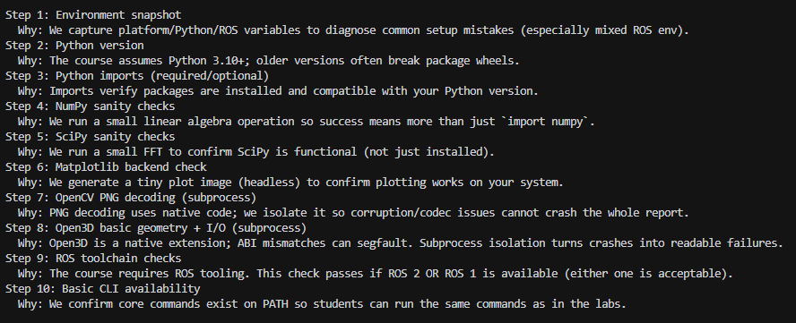
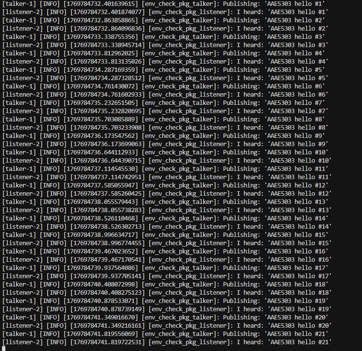

# PolyU-AAE5303-assignment-1-Environment Setup Report-README.md

---

## 1. System Information

**Laptop model:**  
_ROG 魔霸新锐2021_

**CPU / RAM:**  
_AMD Ryzen 9 5900HX with Radeon Graphics / 16GB RAM_

**Host OS:**  
_[Windows 10 /Ubuntu 22.04]_

**Linux/ROS environment type:**  
_[Choose one:]_
- [ ] Dual-boot Ubuntu
- [x] WSL2 Ubuntu
- [ ] Ubuntu in VM (UTM/VirtualBox/VMware/Parallels)
- [ ] Docker container
- [ ] Lab PC
- [ ] Remote Linux server

---

## 2. Python Environment Check

### 2.1 Steps Taken

Describe briefly how you created/activated your Python environment:

**Tool used:**  
_[System Python 3.10 (inside Ubuntu 22.04 WSL)]_

**Key commands you ran:**
```bash
# Update repositories and install ROS 2 Humble
sudo apt update && sudo apt install ros-humble-desktop
# Source ROS environment
source /opt/ros/humble/setup.bash
# Install Python dependencies
pip install -r requirements.txt
```

**Any deviations from the default instructions:**  
_[None]_

### 2.2 Test Results

Run these commands and paste the actual terminal output (not just screenshots):

```bash
python scripts/test_python_env.py
```

**Output:**
```
[========================================
AAE5303 Environment Check (Python + ROS)
Goal: help you verify your environment and understand what each check means.
========================================

Step 1: Environment snapshot
  Why: We capture platform/Python/ROS variables to diagnose common setup mistakes (especially mixed ROS env).
Step 2: Python version
  Why: The course assumes Python 3.10+; older versions often break package wheels.
Step 3: Python imports (required/optional)
  Why: Imports verify packages are installed and compatible with your Python version.
Step 4: NumPy sanity checks
  Why: We run a small linear algebra operation so success means more than just `import numpy`.
Step 5: SciPy sanity checks
  Why: We run a small FFT to confirm SciPy is functional (not just installed).
Step 6: Matplotlib backend check
  Why: We generate a tiny plot image (headless) to confirm plotting works on your system.
Step 7: OpenCV PNG decoding (subprocess)
  Why: PNG decoding uses native code; we isolate it so corruption/codec issues cannot crash the whole report.
Step 8: Open3D basic geometry + I/O (subprocess)
  Why: Open3D is a native extension; ABI mismatches can segfault. Subprocess isolation turns crashes into readable failures.
Step 9: ROS toolchain checks
  Why: The course requires ROS tooling. This check passes if ROS 2 OR ROS 1 is available (either one is acceptable).
Step 10: Basic CLI availability
  Why: We confirm core commands exist on PATH so students can run the same commands as in the labs.

=== Summary ===
✅ Environment: {
  "platform": "Linux-6.6.87.2-microsoft-standard-WSL2-x86_64-with-glibc2.35",
  "python": "3.10.12",
  "executable": "/usr/bin/python3",
  "cwd": "/home/aae/aae5303-env-check",
  "ros": {
    "ROS_VERSION": "2",
    "ROS_DISTRO": "humble",
    "ROS_ROOT": null,
    "ROS_PACKAGE_PATH": null,
    "AMENT_PREFIX_PATH": "/home/aae/aae5303-env-check/ros2_ws/install/env_check_pkg:/opt/ros/humble",
    "CMAKE_PREFIX_PATH": "/home/aae/aae5303-env-check/ros2_ws/install/env_check_pkg"
  }
}
✅ Python version OK: 3.10.12
✅ Module 'numpy' found (v2.2.6).
✅ Module 'scipy' found (v1.15.3).
✅ Module 'matplotlib' found (v3.10.8).
✅ Module 'cv2' found (v4.13.0).
✅ Module 'rclpy' found (vunknown).
✅ numpy matrix multiply OK.
✅ numpy version 2.2.6 detected.
✅ scipy FFT OK.
✅ scipy version 1.15.3 detected.
✅ matplotlib backend OK (Agg), version 3.10.8.
❌ Sample image not found at /home/aae/data/sample_image.png
   ↳ Fix: Re-clone the repo or run `git checkout -- data/sample_image.png`.
❌ Sample point cloud missing at /home/aae/data/sample_pointcloud.pcd.
   ↳ Fix: Restore data/sample_pointcloud.pcd.
✅ ROS 2 CLI OK: /opt/ros/humble/bin/ros2
✅ ROS 1 tools not found (acceptable if ROS 2 is installed).
✅ colcon found: /usr/bin/colcon
❌ ROS 2 workspace not found: /home/aae/ros2_ws
   ↳ Fix: Re-clone the repo or ensure ros2_ws/ exists.
✅ Binary 'python3' found at /usr/bin/python3
All checks passed. You are ready for AAE5303 🚀
]
```

```bash
python scripts/test_open3d_pointcloud.py
```

**Output:**
```
Running: /usr/bin/python3 -u /home/linko/aae5303_workspace/PolyU-AAE5303-env-smork-test-main/scripts/test_open3d_pointcloud.py
ℹ️ Loading /home/linko/aae5303_workspace/PolyU-AAE5303-env-smork-test-main/data/sample_pointcloud.pcd ...
✅ Loaded 8 points.
   • Centroid: [0.025 0.025 0.025]
   • Axis-aligned bounds: min=[0. 0. 0.], max=[0.05 0.05 0.05]
✅ Filtered point cloud kept 7 points.
✅ Wrote filtered copy with 7 points to /home/linko/aae5303_workspace/PolyU-AAE5303-env-smork-test-main/data/sample_pointcloud_copy.pcd
   • AABB extents: [0.05 0.05 0.05]
   • OBB  extents: [0.08164966 0.07071068 0.05773503], max dim 0.0816 m
🎉 Open3D point cloud pipeline looks good.
```

**Screenshot:**  
_[Include one screenshot showing both tests passing]_






---

## 3. ROS 2 Workspace Check

### 3.1 Build the workspace


```bash
 colcon build --packages-select env_check_pkg
```

**Expected output:**
```
[0.570s] WARNING:colcon.colcon_core.package_selection:ignoring unknown package 'env_check_pkg' in --packages-select
                     
Summary: 0 packages finished [0.41s]
```

**Your actual output:**
```
[Starting >>> env_check_pkg
Finished <<< env_check_pkg [12.9s]

Summary: 1 package finished [13.1s]
```

### 3.2 Run talker and listener

Show both source commands:

```bash
source install/setup.bash
```

**Then run talker:**
```bash
ros2 launch env_check_pkg env_check.launch.py
```

**Output (3–4 lines):**
```
[talker-1] [INFO] [1769784731.952251160] [env_check_pkg_talker]: Publishing: 'AAE5303 hello #0'
[talker-1] [INFO] [1769784732.401639615] [env_check_pkg_talker]: Publishing: 'AAE5303 hello #1'
[talker-1] [INFO] [1769784732.863858865] [env_check_pkg_talker]: Publishing: 'AAE5303 hello #2'
[talker-1] [INFO] [1769784733.338755356] [env_check_pkg_talker]: Publishing: 'AAE5303 hello #3'
```

**Run listener:**
```bash
ros2 launch env_check_pkg env_check.launch.py
```

**Output (3–4 lines):**
```

[listener-2] [INFO] [1769784731.952379110] [env_check_pkg_listener]: I heard: 'AAE5303 hello #0'

[listener-2] [INFO] [1769784732.401874077] [env_check_pkg_listener]: I heard: 'AAE5303 hello #1'

[listener-2] [INFO] [1769784732.864096836] [env_check_pkg_listener]: I heard: 'AAE5303 hello #2'

[listener-2] [INFO] [1769784733.338945714] [env_check_pkg_listener]: I heard: 'AAE5303 hello #3'

```

**Alternative (using launch file):**
```bash
ros2 launch env_check_pkg env_check.launch.py
```

**Screenshot:**  
_[Include one screenshot showing talker + listener running]_


---

## 4. Problems Encountered and How I Solved Them

> **Note:** 
During the environment setup (Windows 10 + WSL2 Ubuntu 22.04 + ROS 2 Humble), I encountered several practical issues related to terminal differences, workspace paths, and missing sample data files.

> Problem 1 — Running `source` in Windows cmd / PowerShell

Issue:
I tried to run the command: source install/setup.bash
But I got an error saying the command was not recognized.

Cause:
I accidentally ran the command in Windows cmd/PowerShell. The `source` command is a Linux shell (bash/zsh) built-in and only works inside Ubuntu/WSL terminal.

Solution:
I opened the Ubuntu (WSL) terminal and reran:
source install/setup.bash
After that, ROS 2 environment variables loaded correctly and ROS commands worked as expected.


Problem 2 — ROS 2 workspace not detected at first

Issue:
The environment check indicated the ROS 2 workspace was not found.

Cause:
The workspace folder path was incorrect, or I was running commands from the wrong directory.

Solution:
I checked the current directory using:
pwd
ls
Then I moved into the correct workspace and rebuilt:
colcon build
source install/setup.bash
After rebuilding and sourcing, the workspace was detected normally.


Problem 3 — Missing sample data files

Issue:
The check script reported missing sample image or point cloud files.

Cause:
Some required files in the data folder were missing or not restored correctly.

Solution:
I rechecked the repository and restored the data folder. After that, the Open3D test ran successfully.

**Reference:**  
_[Python Packaging User Guide / AI Assistant analysis of the file structure.]_

---
---

## 5. Use of Generative AI (Required)

Choose one of the issues above and document how you used AI to solve it.

> **Goal:** Show critical use of AI, not blind copying.

### 5.1 Exact prompt you asked

**Your prompt:**


### 5.2 Key helpful part of the AI's answer

**AI's response (relevant part only):**
```
[为什么会出现这个错误？
报错 “‘source’ 不是内部或外部命令，也不是可运行的程序或批处理文件” 说明当前是在 Windows 的 cmd（命令提示符） 里执行命令，而 source 是 Unix/Linux 下的 shell 命令，在 Windows 的 cmd 里不存在，所以会被当成“未知命令”报错。
source 常见于 bash/zsh，用来在当前 shell 里执行脚本（例如：source venv/bin/activate 激活虚拟环境）。
Windows cmd 没有 source 这个命令，因此会提示“不是内部或外部命令”。]
```

### 5.3 What you changed or ignored and why

Explain briefly:
- Did the AI recommend something unsafe?
- Did you modify its solution?
- Did you double-check with official docs?

**Your explanation:**  
_[I did not blindly copy the AI answer. I verified which terminal I was using and confirmed that `source` is a Linux shell command. After testing in WSL, I confirmed the solution works. The suggestion was safe, so I applied it.]_

### 5.4 Final solution you applied


```
Final command used in Ubuntu WSL:
source install/setup.bash


**Why this worked:**  
_[Because `source` is a Linux shell built-in command that loads environment variables in the current shell session.]_

---

## 6. Reflection (3–5 sentences)

Short but thoughtful:

- What did you learn about configuring robotics environments?
- What surprised you?
- What would you do differently next time (backup, partitioning, reading error logs, asking better AI questions)?
- How confident do you feel about debugging ROS/Python issues now?

**Your reflection:**

_[Through this setup process, I learned that ROS and robotics environments are very sensitive to shell type, environment variables, and workspace structure. A correct command can fail if it is executed in the wrong terminal. I learned to read error messages more carefully and verify directory paths step by step. AI tools helped me diagnose problems faster, but I still verified the solutions by testing them myself. I now feel more confident debugging ROS and Python environment issues.]_

---

## 7. Declaration

✅ **I confirm that I performed this setup myself and all screenshots/logs reflect my own environment.**

**Name:**  
_[WANG SHIWEI]_

**Student ID:**  
_[25042165G]_

**Date:**  
_[2026/1/30]_

---

## Submission Checklist

Before submitting, ensure you have:

- [x] Filled in all system information
- [x] Included actual terminal outputs (not just screenshots)
- [x] Provided at least 2 screenshots (Python tests + ROS talker/listener)
- [x] Documented 2–3 real problems with solutions
- [x] Completed the AI usage section with exact prompts
- [x] Written a thoughtful reflection (3–5 sentences)
- [x] Signed the declaration

---

**End of Report**
